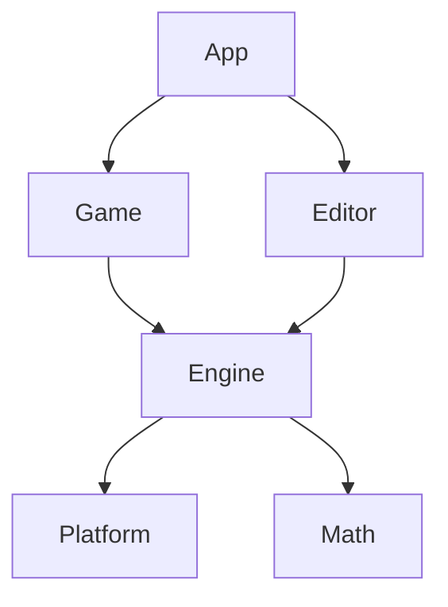

# Chapter 8 — Packages and Project Organization

[← Chapter 7: Control Flow](07-control-flow.md) · [Exercises](../exercises/08-packages.md) · [Chapter 9: Arrays, Slices and Dynamic Arrays →](09-arrays-slices-dynamic-arrays.md)

Odin organizes code into packages. A package is a directory of related `.odin` files compiled together as one namespace. This model is simple, but it has strong architectural consequences: file boundaries serve readers, while package boundaries define dependencies and ownership.

## 8.1 A package is a directory

Every source file starts with a package declaration:

```odin
package main
```

Files in the same directory normally use the same package name and can access one another's declarations without importing sibling files.

```text
app/
├── main.odin
├── config.odin
└── logging.odin
```

Build or run the directory:

```bash
odin run ./app
odin build ./app
```

Do not think of Odin as compiling one source file at a time. The package is the unit.

## 8.2 Executable packages

An executable uses `package main` and defines an entry point:

```odin
package main

main :: proc() {
}
```

The `main` package is a natural composition root. It should create services, connect packages, run the application, and shut systems down. It should not contain every implementation detail.

## 8.3 Importing packages

```odin
import "core:fmt"
import "core:os"
```

The prefix identifies a collection. `core:` points to Odin's core library. Imported declarations remain qualified:

```odin
fmt.println("hello")
args := os.args
```

Qualified access makes dependency origin visible and avoids unnecessary global names.

## 8.4 Import aliases

```odin
import formatting "core:fmt"

formatting.println("hello")
```

Use aliases when package names collide or a foreign package name is awkward. Avoid unexplained abbreviations or aliases that conceal where an API comes from.

## 8.5 Local packages

A larger project may use this layout:

```text
my_app/
├── app/
│   └── main.odin
├── engine/
│   ├── engine.odin
│   └── timing.odin
├── assets/
│   └── loader.odin
└── platform/
    └── platform.odin
```

The executable composes lower-level packages instead of placing everything in `main`.

## 8.6 Collections

Collections map stable import prefixes to directories. For example:

```bash
odin build ./app -collection:project=./
```

Code can then import:

```odin
import "project:engine"
import "project:assets"
```

Collections are easier to maintain than long relative import paths and make repository boundaries explicit.

## 8.7 Designing package boundaries

A package should expose one coherent capability. Good examples include:

- `math2d` for geometry operations;
- `assets` for resource loading and handles;
- `protocol` for encoding and wire types;
- `renderer` for rendering commands and resources;
- `storage` for persistence.

Avoid dumping grounds named `utils`, `common`, or `helpers`. They accumulate unrelated code and erase architecture.

## 8.8 Names and qualification

Inside an `assets` package, prefer:

```odin
texture := assets.load_texture(path)
```

over a redundant name such as `assets.assets_load_texture`. The package qualifier already provides context.

At the same time, names should reveal cost and behavior. `assets.get(path)` is vague: does it load from disk, return a cache entry, allocate memory, or fail?

## 8.9 Dependency direction

Healthy package graphs have a clear direction:



When two packages need each other, consider:

- extracting shared data into a lower-level package;
- moving orchestration into a higher-level package;
- introducing callbacks at the composition root;
- merging packages that are not truly independent.

Cycles are architectural feedback, not merely compiler inconvenience.

## 8.10 Ownership belongs somewhere

A package should usually own the data and invariants it manages:

```odin
Texture_Handle :: distinct u32

Registry :: struct {
    // internal storage
}

load_texture :: proc(registry: ^Registry, path: string) -> Texture_Handle
release_texture :: proc(registry: ^Registry, handle: Texture_Handle)
```

Callers use the package API instead of manipulating registry internals directly. A useful review question is: can the internal representation change without rewriting every caller?

## 8.11 File organization inside a package

Do not create one file per procedure or struct. Group by concept:

```text
renderer/
├── renderer.odin
├── commands.odin
├── resources.odin
├── shaders.odin
└── backend_opengl.odin
```

File organization is for navigation. Package organization is for architecture.

## 8.12 Platform-specific code

Keep operating-system decisions localized:

```text
platform/
├── platform.odin
├── platform_windows.odin
├── platform_linux.odin
└── platform_darwin.odin
```

The rest of the application should depend on a stable platform API rather than scattering conditionals throughout the codebase.

## 8.13 Third-party dependencies

For reproducible builds, keep dependency versions and licenses explicit. Foreign APIs are often best wrapped behind project-owned packages:

```text
vendor/
├── sdl/
├── stb/
└── bindings/
```

A wrapper can normalize ownership, error handling, naming, and platform differences. Do not re-export an entire dependency without adding a deliberate boundary.

## 8.14 Initialization and shutdown

Prefer explicit lifetime:

```odin
renderer_state := renderer.init(window, allocator)
defer renderer.shutdown(&renderer_state)
```

Visible initialization makes dependencies, failure paths, and teardown order reviewable. Hidden global startup is convenient only until systems need deterministic ordering or tests need isolation.

## 8.15 Package APIs should stay small

Expose the operations callers need, not every internal declaration. A narrow API is easier to document, test, and change.

Separate:

- stable domain-facing types;
- internal storage details;
- foreign-library bindings;
- debug and tooling functions.

## 8.16 Tests and examples

Tests should verify package contracts and invariants. Examples should be small executable packages that demonstrate realistic use. Keep setup reproducible and avoid relying on private machine configuration.

## 8.17 Common mistakes

### One giant `main` package

This hides dependency direction and encourages unrelated global state.

### Premature micro-packages

A package for every small type creates navigation and dependency overhead. Split when ownership or responsibility becomes clear.

### Conceptual cycles

Even without a literal import cycle, packages that constantly reach into each other's state are too tightly coupled.

### Generic shared packages

A growing `common` package often means the architecture has not decided who owns the code.

## 8.18 Worked project layout

```text
calculator/
├── app/
│   └── main.odin
├── expression/
│   ├── token.odin
│   ├── lexer.odin
│   └── parser.odin
└── evaluation/
    └── evaluate.odin
```

Dependency direction:

```text
app -> expression
app -> evaluation
evaluation -> expression
```

The parser owns syntax structures. The evaluator consumes them. The app handles user interaction.

## Chapter summary

- A package is a directory compiled as one namespace.
- Build and run package directories rather than isolated files.
- Imports remain qualified and make dependencies visible.
- Collections provide stable project import roots.
- Organize packages around ownership and coherent capabilities.
- Keep dependency direction clear and platform details localized.
- Let `main` compose systems while lower-level packages implement them.

## References

- [Odin overview](https://odin-lang.org/docs/overview/)
- [Odin compiler repository](https://github.com/odin-lang/Odin)

[Exercises →](../exercises/08-packages.md) · [Next chapter →](09-arrays-slices-dynamic-arrays.md)
